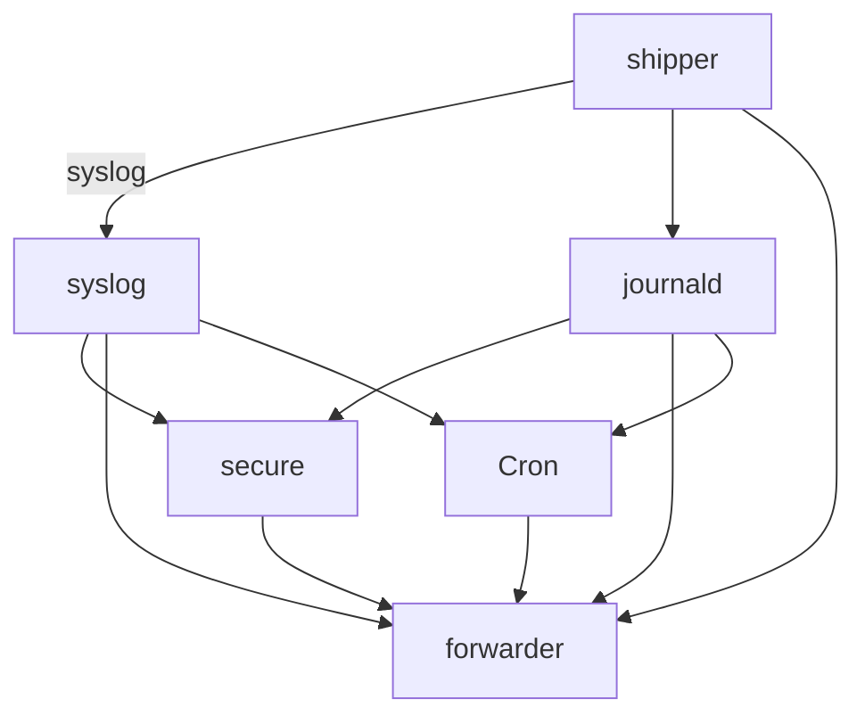
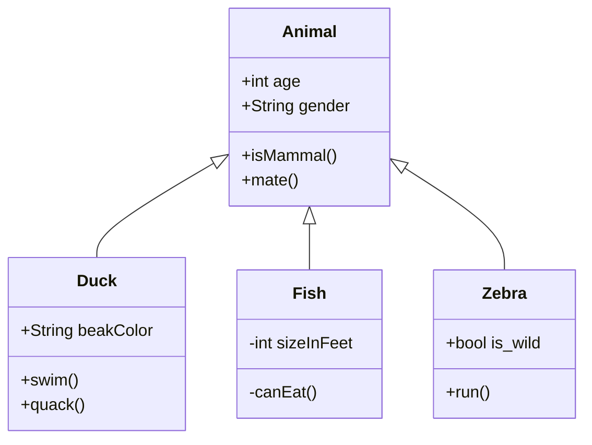
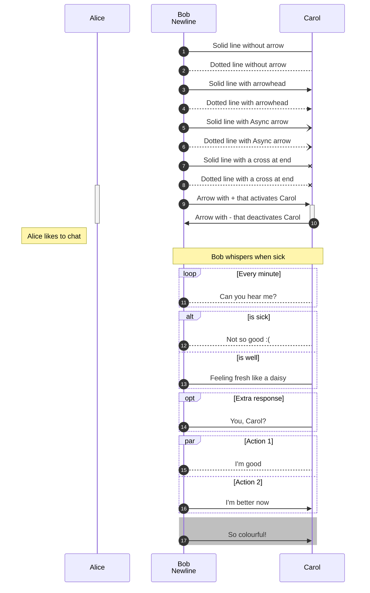
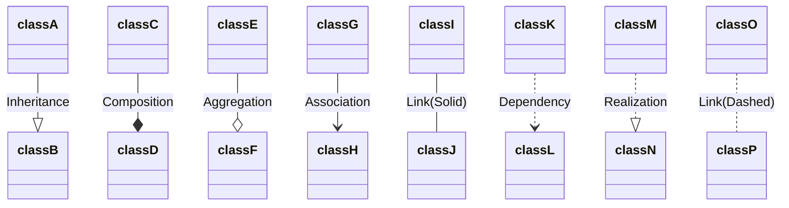
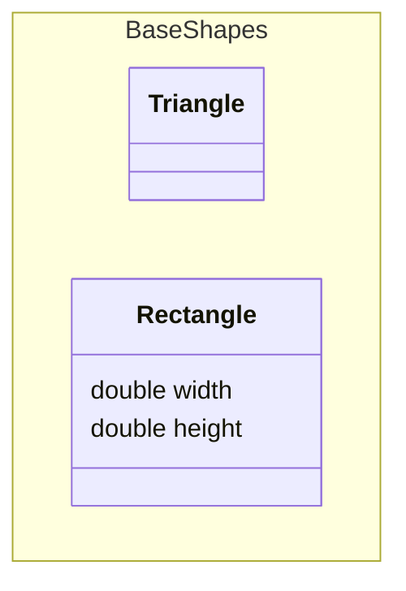
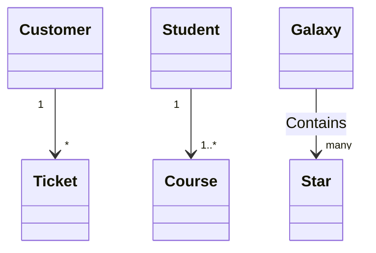

Structure

```mermaid
graph TD
    A[shipper] -->|syslog| B[syslog]
    A --> C[journald]
    B --> D[secure]
    C --> D
    D --> E[forwarder]
    A --> E
    B --> E
    C --> E
    B --> F[Cron]
    C --> F
    F --> E
```

```mermaid
classDiagram
    Animal <|-- Duck
    Animal <|-- Fish
    Animal <|-- Zebra
    Animal : +int age
    Animal : +String gender
    Animal: +isMammal()
    Animal: +mate()
    class Duck{
        +String beakColor
        +swim()
        +quack()
    }
    class Fish{
        -int sizeInFeet
        -canEat()
    }
    class Zebra{
        +bool is_wild
        +run()
    }
```

## foobar 2

```mermaid
sequenceDiagram %% diagram
  autonumber
  %% participant
  participant Alice
  participant B as Bob<br>Newline
  participant C as Carol
  %% arrows
  B->C: Solid line without arrow
  B-->C: Dotted line without arrow
  B->>C:Solid line with arrowhead
  B-->>C: Dotted line with arrowhead
  B-)C: Solid line with Async arrow
  B--)C: Dotted line with Async arrow
  B-xC: Solid line with a cross at end
  B--xC: Dotted line with a cross at end
  %% activation, shorthand
  activate Alice
  B->>+C: Arrow with + that activates Carol
  C->>-B: Arrow with - that deactivates Carol
  deactivate Alice
  %% notes
  Note left of Alice: Alice likes to chat
  Note over B,C: Bob whispers when sick
  %% loop
  loop Every minute
    B-->C: Can you hear me?
  end
  %% alt
  alt is sick
    B-->C: Not so good :(
  else is well
    B->C: Feeling fresh like a daisy
  end
  opt Extra response
    B->C: You, Carol?
  end
  %% par
  par Action 1
    B-->C: I'm good
  and Action 2
    B->>C: I'm better now
  end
  rect rgba(128, 128, 128, 0.5)
    B->>C: So colourful!
  end
```

```mermaid
classDiagram
  classA --|> classB : Inheritance
  classC --* classD : Composition
  classE --o classF : Aggregation
  classG --> classH : Association
  classI -- classJ : Link(Solid)
  classK ..> classL : Dependency
  classM ..|> classN : Realization
  classO .. classP : Link(Dashed)

```

```mermaid
classDiagram
namespace BaseShapes {
    class Triangle
    class Rectangle {
      double width
      double height
    }
}
```

```mermaid
classDiagram
    Customer "1" --> "*" Ticket
    Student "1" --> "1..*" Course
    Galaxy --> "many" Star : Contains
```