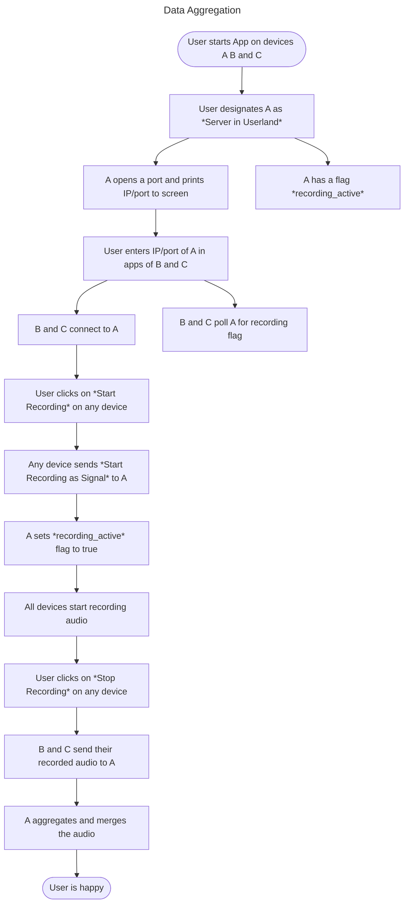

# AudioMerge
The MVP for client-side proof of concept for the com-snippet protocol is a tool that records audio from multiple devices at the same time, then merges the audio streams into a single audio file, denoising and normalizing the audio in the process.
The resulting single audio file can then be further processed.
Further processing may include the translation of the audio into text - specifically the [International Phonetic Alphabet](https://en.wikipedia.org/wiki/International_Phonetic_Alphabet), that could be used to reconstruct the original spoken words without sending the original audio file over the internet, which fits with the idea of multiple "masks" for anonymity as well as for data compression.

## Recording Audio
The first step is to record audio from multiple devices at the same time.
For this, we need a client-side application that can record audio from the microphone and save it locally.

The application runs on different devices at the same time, the user can start recording whenever they want.
The application then records audio from the microphone and saves it locally.
The user can stop recording whenever they want.
The application then stops recording and saves the audio file locally.

## Aggregation
Next we want to merge the audio files from the different devices into a single audio file. For this, one of the applications is designated as the **server in userland**. For simplicity, this should be an application running on a desktop computer, as it is easier to merge audio files on a desktop computer than on a mobile device.
The server in userland is the application that is used to merge the audio files, acting as an intermediary, aggregating and pre-computing the data before sending it to the **router in serverland**.
We don't concern ourselves with *serverland* for now, as it is not part of this PoC.

To designate the **server in userland**, the user starts the application on the device that they want to use as the server and clicks on the "designate as primary" button.

This opens a port on the device and prints the IP address and port number to the screen for the user to share with the other devices. (This is a hassle that could be simplified with a QR code, but for now, we don't concern ourselves with that.)

The user then starts the application on the other devices and clicks on the "connect to primary" button, entering the IP address and port number of the **server in userland**. This establishes a connection between the devices and the **server in userland**. We use AMQP for this, as it should serve well us in this case. The user then can start recording on any of the devices, which will tell the other connected devices to record, as well. The user can stop recording on any of the devices, which will tell the other connected devices to stop recording, as well. The recorded audio then is sent to the **server in userland**, collecting the recordings from all devices.

## Synchronization
Once the audio files are collected on the **server in userland**, they need to be synchronized. This is done by comparing the audio files and finding the first *clap* in the recording. A *clap* is a transient (spike) sound across a very broad frequency spectrum, which makes it easy to detect. Once the first *clap* is found, a time offset is calculated for each audio file, so that the *clap* is at the same time in each audio file. The audio file with the shortest distance from the start to the *clap* is determined and used as the reference for the other audio files. The other recordings are cut so that they all start at the same time, have matching claps and are of the same length.

## Denoising
Since we now have multiple recordings of the same audio, we can apply more sophisticated denoising techniques. We use the [spectral subtraction method](https://en.wikipedia.org/wiki/Spectral_subtraction) to denoise the audio. This method is based on the assumption that the noise is additive and stationary. This is a reasonable assumption, as the noise is mostly the same across all recordings and is not correlated with the audio signal.

# Data Aggregation

#amqp version: 1.0
#work queue

https://qpid.apache.org/releases/qpid-proton-0.39.0/proton/python/docs/tutorial.html

https://qpid.apache.org/releases/qpid-proton-0.39.0/proton/python/docs/types.html#types