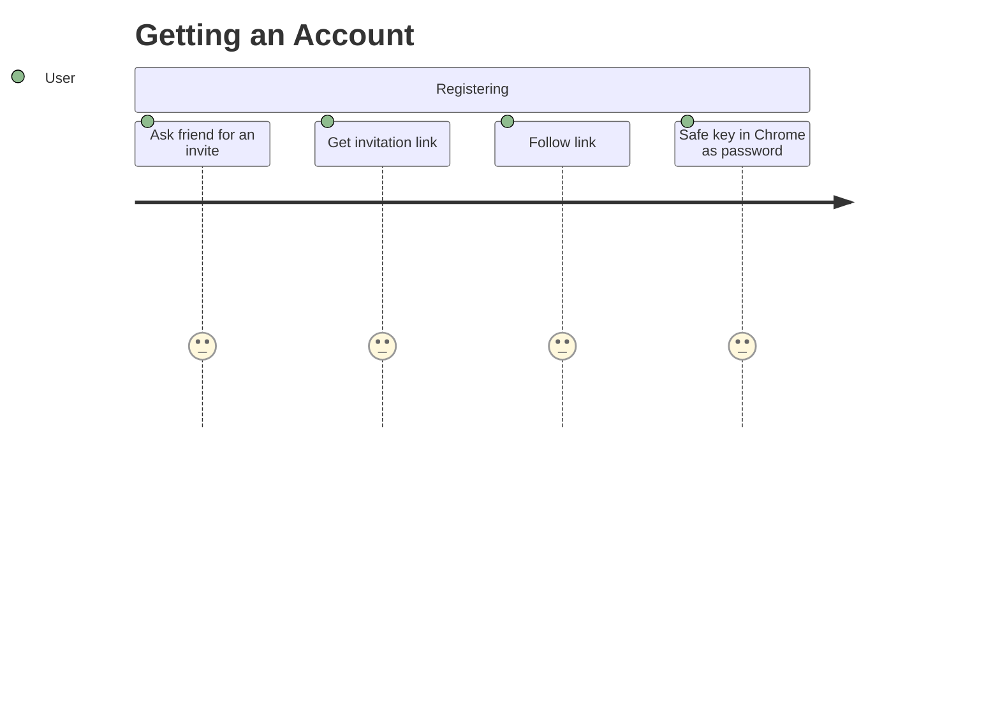
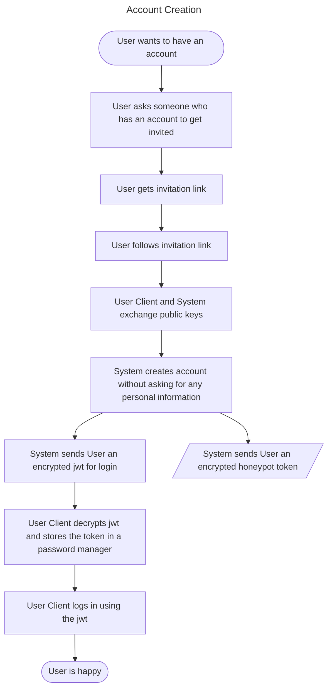
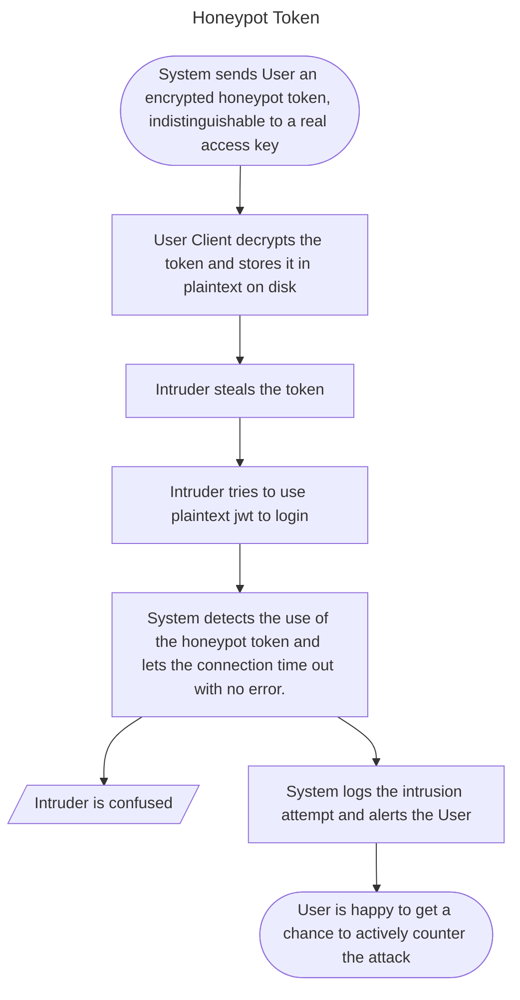
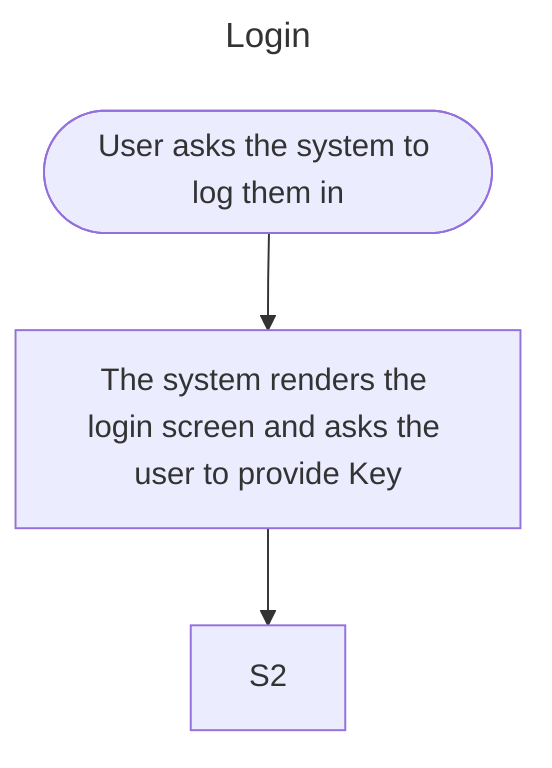
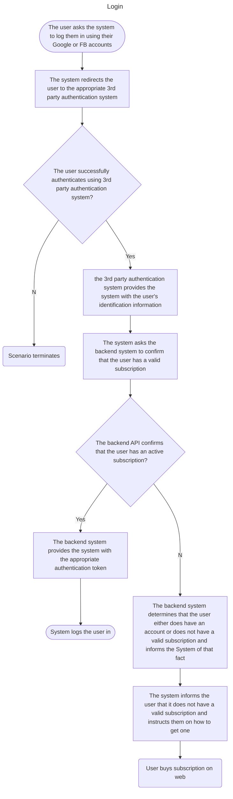

# Authentication

## Account Creation
As outlined in **voting**, all sensitive data is stored and handled separately through LegalEntity. The Account on the other hand represents the login of a user, with no sensitive data attached to it. A **User** is a person who has an Account or wants to interact with the system in some way.
At first, all Accounts are anonymous, with no sensitive data attached to them. The user can choose to attach sensitive data in order to gain access to more features, but this is not required. The main purposes of attaching sensitive data is to gain access to the voting system (as only identified users can vote), being able to regain access to the account in case of having lost access to the account as well as being able to use parts of the system that require credits or financial data.

So, how to get an Account?

## Invitation Link
The invitation link is generated and saved by the user who wants to invite another user. The link contains a unique identifier, which is used to identify the user who invited the new user. The link is sent to the new user, who can then follow the link to register an account. By default the link can only be used once, but

## Login

### The user logs into the system

The Key is an encrypted jwt token. The user can choose to store the key in the browser, or to store it in a password manager.

---

The system renders the login screen and asks the user to provide their credentials
The user provides its credentials (email and password) and asks the system to log them in
The system asks the backend API to verify users’ credentials
The backend API confirms that the provided credentials are valid
The backend API confirms that the user has an active subscription
The backend API provides the system with an authentication token for the user
The system logs the user in
The main success scenario ends.

Extension 2a: The user authenticates via 3rd party system (Google, Facebook)
---
2a1. The user asks the system to authenticate it via 3rd party authentication system (Google or Facebook)

2a2. The system redirects the user to the appropriate 3rd party authentication system

2a3. The user successfully authenticates using 3rd party authentication system and the 3rd party authentication system provides the system with the user’s identification information

2a4. The system asks the backend API to confirm that the user has a valid account and a valid subscription

2a5. The backend API confirms that the user indeed has a valid account and a subscription

2a6. The backend system provides the system with the appropriate authentication token

2a7. The main success scenario resumes from step 7

Extension 2a4a: The user does not have a valid account
---

2a4a1. The backend system determines that the user does not have a valid account and informs the System of that fact

2a4a2. The system informs the user that their credentials are not valid

2a4a3. The main success scenario restarts from step 1

Extension 2a4b: The user does not have a valid subscription
---

2a4b1. The backend system determines that the user does have an account but does not have a valid subscription and informs the System of that fact

2a4b2. The system informs the user that it does not have a valid subscription, and instructs them to go to the web to buy a subscription

2a4b3. The main success scenario terminates

