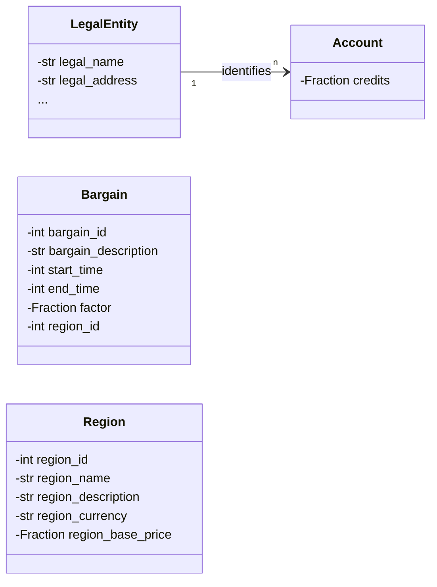

# Credits
Credits represent real-life money. Real-life money is needed to pay for server expenses and developers, thus it is crucial to offer End-Users and businesses value they are willing to pay for. Usually, buying credits is a one-way street, so that the money is not lost to the system. However, if someone is registered as a member of the club or the company, their credits can be converted back to real-life money for certain purposes. This is to ensure that the system is not used for money laundering. Inside the system, credits can only be used for things such as cosmetics, advertising, bounties and so on that are not directly related to community-building or the core functionality.
Credits can be traded via the **exchange** into karma and vice versa. The exchange is a Vickrey-Clarke-Groves auction that is run every 8 hours. The exchange is described in more detail in this [document](https://github.com/TetraPlex-org/basics/blob/main/Documentation/technical/exchange.md).
Let's call *credits* **Tc** (TetraPlex credits) and *karma* **Tk** (TetraPlex karma) in short.

## Who would buy Credits?
We envision credits as an incentive system for those with the financial means to offer bounties for some tasks that he or she wants to accomplish but do not have either the time of skill to accomplish within acceptable time and quality parameters. We however aim to be fair and allow people with limited means to be able to afford credits too to be similarly be able to participate in the in network economy and access the skills of other people in this network. Hence Tetraplex is a gig economy platform for people who want extra income as well as a platform for being able to find transient labor for certain tasks. We probably need some guidelines on what services are allowed in the system. Some things like law or medicine maybe off limits due to medical and / or legal risks.

## Credit Buyer Personas
* Frank is an entrepreneur and wants someone to test his new web platform. He pays credits to the system, the system takes transaction fees and a freelance tester does the task and files a report for a bounty claim, the tester gets paid in credits after Frank sees the report.

* Amy is setting up a new startup and wants a lawyer to review her Founders Agreement. She sets up a bounty and a skilled law student reviewed her documents. The law student made document revisions and told her to consult a real lawyer but the edits made sense and he gets paid after the edits were reviewed.

* James is a furry and wants a bear avatar... he sets a bounty for his furry persona (fursona) and a graphics artist designs a reference sheet (ref sheet) for his bear OC (Original Character) based on the character bio and description that was on the bounty. The graphics artist was paid credits after the avatar and ref sheet was reviewed and accepted. James now uses the bear avatar in Tetraplex and is very happy.

## How to get Credits?
Finding a good price that is acceptable for everyone is a very difficult task. Since this is about buying a virtual commodity with real-life money, we have to be very careful to not be seen as a scam or otherwise fraudulent, immoral or illegal. This means that prices need to be adjusted to regional differences in income while making it difficult for rich people to circumvent regional price differences using VPNs and multiple straw-man accounts or buying in bulk and selling at a higher price later or causing inflation and thus cheapening the value for everyone.

## What's the price?
So, let's assume we have established strong identity via LegalEntity and the user has a verified bank account. The user can now buy credits via the **shop**. How to price credits? Let's bootstrap the process with a price of 10 $ for a *standard bucket* of 10 credits. In the process of buying said credits, the user is asked following question: "Guess which price other people within your region think is fair on average! If your guess is closest to the result, you win an extra bucket!", to be evaluated every week.

This kind of "game" is derived from [Guess 2/3 of the average](https://en.wikipedia.org/wiki/Guess_2/3_of_the_average), which is similar to the "Keynesian beauty contest", a thought-experiment published by John Maynard Keynes in *The General Theory of Employment, Interest and Money* (1936). This solves the problem of finding the best price per region

Next problem results from rich people being able to use a VPN to the cheapest region and buy credits there. We don't combat this kind of behaviour in general, but instead we keep track of daily purchases. Once a user has bought more than 10 buckets (100 Tc), no more time-limited action factors are applied and instead, we apply a factor of

    log(current_daily_sum_of_purchased_credits) * base_region_price

to the price. This means that the price increases logarithmically with the amount of credits bought per day. This is to prevent rich people from buying lots of cheap credits in a region and then selling them at a higher price later. There is also no automatic way to buy credits in bulk, but except for increments of 10 credits (a bucket). So if you want to buy 1000 credits, you would buy 10 buckets at the flat, local, reduced price and then 90 buckets at the logarithmically increased price, one at a time, so overall, with a base price of 10 $ per 10 Tc, you would pay

    10 $ * 10 = 100 + sum(log(x)*x for x in range(100, 1010, 10)) $ = 322121 $

for 1000 credits. This is a lot of money, if you are not willing to wait between purchases, which would cause the logarithmic price to drop again.