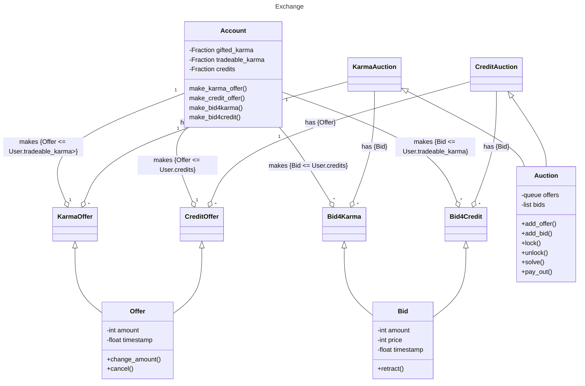

# Karma-Credits Auctions

Applying the Vickrey-Clarke-Groves mechanism to the Karma-Credits system.
To do this, we have a so-called queue-pool of offers. Every user puts their offer into the queue-pool. Offers are ordered by the time they were put into the pool. Other than that, there is no prioritization. Offers are not visible to other users and can be changed at any time. At the end, it does not matter if multiple smaller or one big offer is made. The only thing that matters is the total amount of karma/credits offered.
While all offers go into the queue-pool, users can make multiple bids (extra bids cost karma). Each bid is a bid for a certain amount of karma/credits at a certain price. Bids are not visible to other users.
Bids are unordered and unprioritized.
Every 8 hours, the queue-pool is locked. From this point on, all offers become a single pool and no more bids can be made. The bids then become a knapsack-problem with the goal to maximize the price.
Bids that don't make it into the solution are discarded. The price of all winning bids is averaged and offers are paid out accordingly. Bidders pay what they bid, not what the winning price was.
Offers are handled by the order of their timestamp.
Offers can be split up into any number of bids, but the total amount of karma/credits offered must be the same. The rest of the offer remains in the queue with the same timestamp.
The queue-pool is then unlocked and the remaining offers are queued at the top of the queue-pool. New offers are added to the bottom. The cycle repeats.

This ensures that old offers are always handled first and that the price is always the same for all users. It also ensures that users can't game the system by making multiple bids with different prices.
It ensures a stable price and a fair distribution of karma/credits with maximum efficiency.

