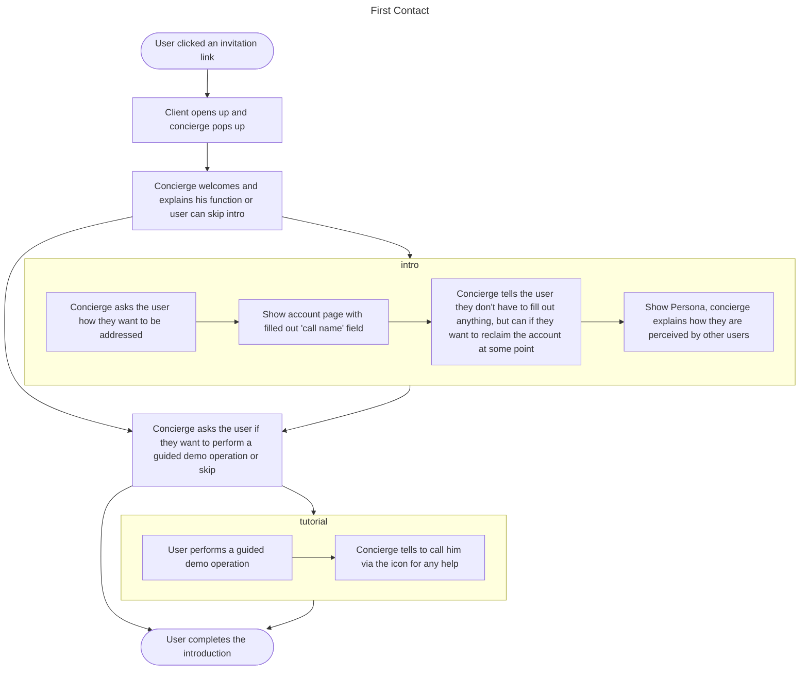
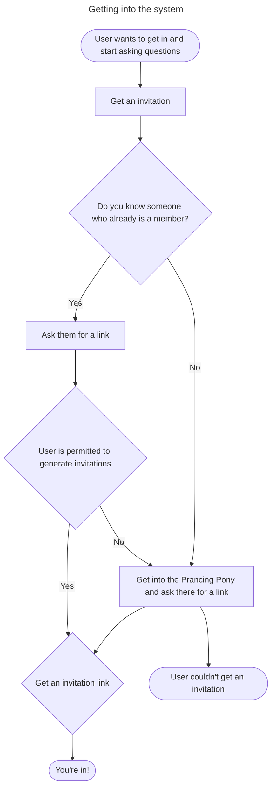
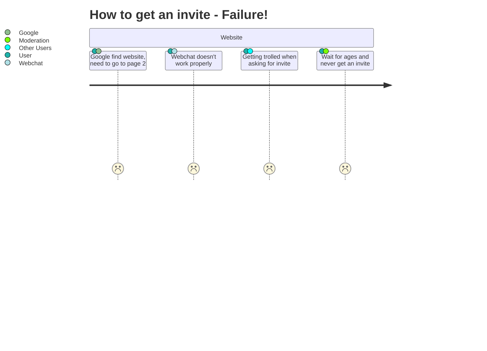
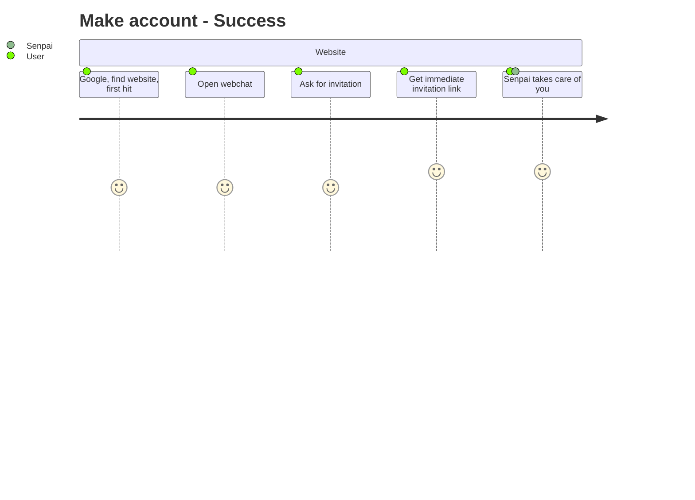
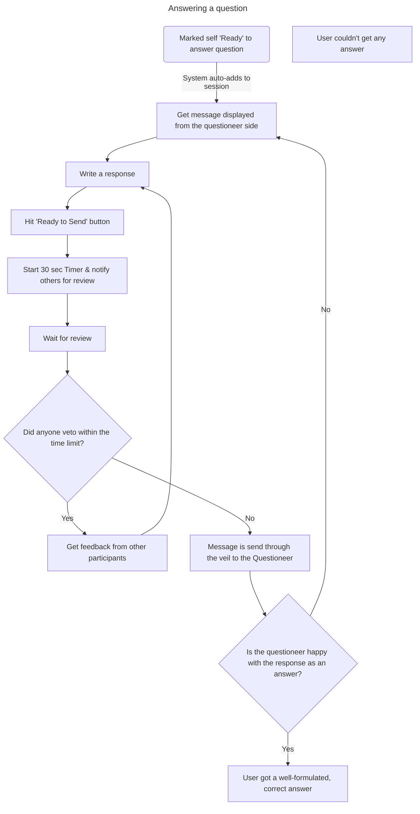

- gets invite code
- congierge popup 1
    - what is tetraplex
    - you were invited by {invite_name}
    -
- concierge popup 2
  - what is veiled
  - (10 seconds overview)
  -
- concierge popup 3
  - click here to call me(concerge)
- start using
- when over(session ends)

