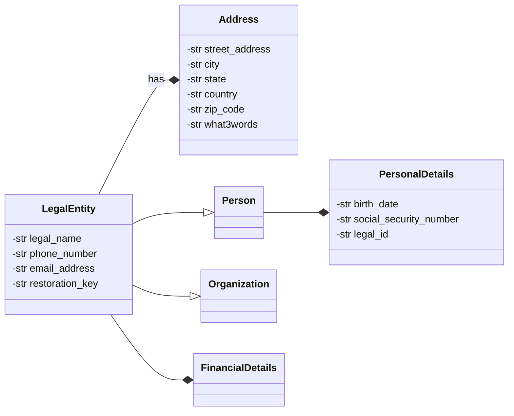

# Private Data

As outlined in [**voting**](https://github.com/TetraPlex-org/basics/blob/main/Documentation/technical/voting.md), all sensitive data is stored and handled separately through LegalEntity.

## Use Cases

Here is a good writeup on [private data use cases](https://www.linkedin.com/pulse/data-privacy-use-cases-age-gdpr-covering-basics-laura-begieneman) and it does cover GDPR.

## Requirements

We should use [GDPR Subject Rights](https://www.gdprsummary.com/data-subject-rights) as a starting point for private data storage requirements. The data storage system shall at minimum be secure and auditable but should be also be able to allow the system to address as much of what the  GDPR Data Subject Rights stipulate and they are as follows:

1. The right to be informed
2. The right of access
3. The right to rectification 
4. The right to erasure
5. The right to restrict processing
6. The right to data portability
7. The right to object
8. Rights about automated decision making and profiling.

Other considerations should be cost of data storage and potential for [leakage of metadata](https://beincrypto.com/learn/metadata-privacy-explained/) as well as performance considerations, market acceptance, technological maturity and stability.

## Discussion

Historically most data have been stored in conventional Relational Databases. The advantages of such is that is this well known, mature and easy to implement and can support rectification and erasure as well as portability. If we do not trust the actors handling the databases then there are [Ledger Databases](https://www.techtarget.com/searchcio/definition/ledger-database) and [Public Blockchains](https://101blockchains.com/public-blockchain/). The disadvantage is these are relatively newer technology and the pool of programmers who are proficient in implementing on these are far fewer and they can be relatively costlier and also there is the technological maturity issue and shifting platforms as well as the difficultly and risk involved in choosing a particular blockchain / ledgerdb  to be the backbone of your sensitive data storage. Also [public blockchains can suspend operations in case of a 51% attack and / or if a run on the particular token used as incentive for the participants in the blockchain nodes occurs](https://techcrunch.com/2022/05/12/terra-halts-its-blockchain-to-prevent-hacks-ust/).  Costwise Public Blockchains can be expensive and/or unpredictable due to processing fees [gas and tips](https://ethereum.stackexchange.com/questions/872/what-is-the-cost-to-store-1kb-10kb-100kb-worth-of-data-into-the-ethereum-block)  and [token volatility](https://cryptorank.io/performance) and for a startup these can become significant. There have been attempts of introducing a [stable coin](https://www.investopedia.com/terms/s/stablecoin.asp) that is pegged to a fiat currency like the USD to eliminate the price volatility issue but many of these have [failed or crashed spectacularly](https://chainsec.io/failed-stablecoins/) and it is risky to be on a blockchain using these tokens. The consensus mechanisms on these blockchains do make saving data on these platforms inefficient relative to a centralized alternative and there have been concerns raised on this matter like [environmental impact](https://www.nasdaq.com/articles/the-environmental-impact-of-blockchain-technology) and [scalability](https://towardsdatascience.com/the-blockchain-scalability-problem-the-race-for-visa-like-transaction-speed-5cce48f9d44). A relatively recent development in auditable and immutable data storage is the [Ledger Database](https://billthevestguy.com/2022/05/02/wtf-are-ledger-databases/) which for most part use same [crypto as blockchain](https://en.wikipedia.org/wiki/Merkle_tree) without the consensus mechanisms that gives blockchain all the scaling, costs and environmental issues. These machine consensus mechanisms are hardly perfect in implementation as anything created by and managed by imperfect humans with sometimes irreconcilable differences and some systems can [fork the consensus](https://www.linkedin.com/pulse/ethereum-fork-emergence-social-framework-consensus-tyler-welmans) making two incompatible versions of the so called truth making [identity theft very feasible in the context of private data](https://cointelegraph.com/news/a-third-of-us-crypto-holders-have-experienced-theft-report) and making the participants in the chain select which version of the **truth** they prefer and which [fork of the chain](https://blaize.tech/article-type/which-blockchain-to-fork-to-start-your-own-cryptocurrency/) to reside in going forwards. We should be skeptical of systems that use popularity or votes to establish ground truth as votes in the system can be subject to manipulation or [hacks](https://decrypt.co/40196/hackers-launch-third-51-attack-on-ethereum-classic-this-month).  While there have been [work on more efficient consensus mechanisms](https://eprints.whiterose.ac.uk/176157/1/2021085616.pdf) aside from [proof of work](https://101blockchains.com/public-blockchain/) and [proof of stake](https://www.investopedia.com/terms/p/proof-stake-pos.asp) most of these have small scale research networks and may not be ready for widespread commercial adoption. While some might dismiss the scaling issue this can become significant if the platform aims to become a superapp or simply gains a critical mass of end users that may end up straining the system. There has been some [outcry over blockchain](https://fedscoop.com/blockchain-for-government-technology-hate/) and some of it maybe justified or not but in some cases adoption of a blockchain based solution have been [slowed or blocked by a market that is hostile to the tech](https://techcrunch.com/2022/06/30/as-the-nft-boom-fades-major-gaming-companies-slow-their-crypto-plans/). Market considerations just as significant as technical ones since in the end the [technology needs a userbase](https://www.raconteur.net/technology/trust-tech-adoption) and some do object to blockchains on moral or environmental grounds. We can have a meta discussion on [trust and where to place it](https://onlinelibrary.wiley.com/doi/full/10.1111/meta.12596). [Do people trust blockchain at all?](https://www.wired.com/story/theres-no-good-reason-to-trust-blockchain-technology/) [Or do they prefer a central authority to step in when the consensus system fails?](https://theconversation.com/people-dont-trust-blockchain-systems-is-regulation-a-way-to-help-110007) Some have argued that [cryptography, decentralisation and
economic incentives that form a blockchain ‘truth machine’ cannot be considered ‘neutral’ and
‘objective’ but rather enforce a very particular form of consensus, which matters...
therefore that the protocol itself is a form of intermediation](http://etheses.dur.ac.uk/13174/1/DisassemblingTrustMachine_JKBrekke_2019.pdf) and hence trust issues do not vanish via the application of math and an intermediary that we place our trust in still exist even if we adopt these platforms. Blockchains are as much subjected to [hacks](https://www.technologyreview.com/2019/02/19/239592/once-hailed-as-unhackable-blockchains-are-now-getting-hacked/) as other tech and probably a lot more often since some properties of the blockchain like [immutable transactions makes it attractive to thieves](https://withpersona.com/blog/cryptocurrency-theft-statistics). At minimum the end users must trust whoever and / or whatever system is in place to keep their private data private and secure and [in most cases a blockchain isn't a hard requirement](https://twitter.com/vgcerf/status/1019987651301081089).

# Conclusion

For the moment consider a relational datastore and / or a ledger database or a hybrid solution employing both. These two options can support erasure and rectification with different mechanisms and [for an immutable centralized ledger db that can be data expiry](https://docs.immudb.io/master/develop/expiration.html) that [isn't possible on a public blockchain](https://www.law.kuleuven.be/citip/blog/distributed-ledger-technologies-and-gdprs-right-to-be-forgotten/) and there is less chance of metadata leak if these are properly configured. There aren't too many private blockchains in widespread use and their node count maybe less than public blockchains so these are half measures not many do adopt as well as [permissioned blockchains that have an approving authority](https://dataconomy.com/2022/11/01/permissioned-blockchain/). A full list of issues with blockchain adoption can be found [here](https://glair.ai/post/challenges-in-the-adoption-of-blockchain-and-how-to-solve-them) and ironically lack of trust is the first thing on the list on something that is supposed to solve that issue without a central authority. The negative market sentiment for blockchain also doesn't exist for RDB or or ledger databases and these are more scalable than a blockchain. Admittedly sentiment maybe tangential from a technical perspective but if [users are hostile to a technology](https://superrare.com/magazine/2022/08/30/why-gamers-hate-nfts-in-games/) it would hinder mass adoption. 

