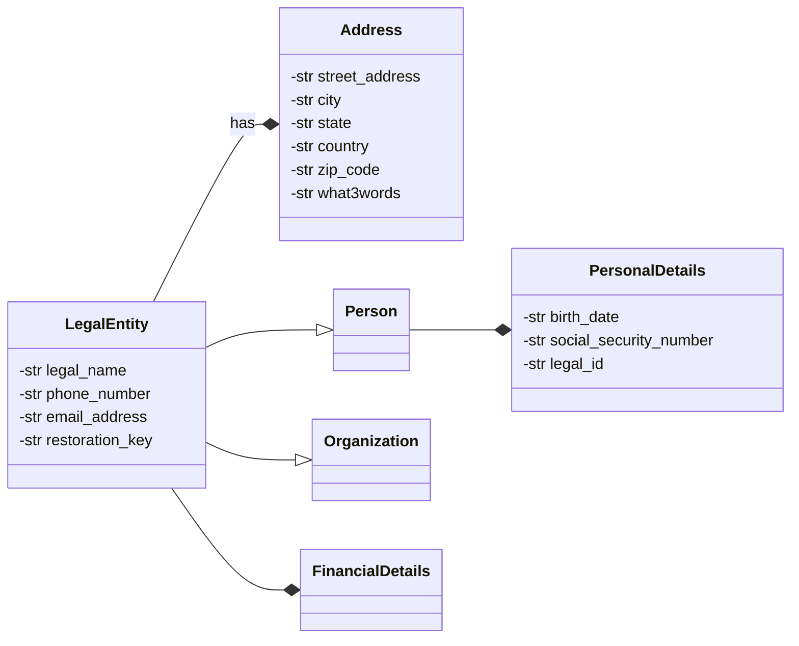

# Private Data

As outlined in **voting**, all sensitive data is stored and handled separately through LegalEntity.

## Use Cases

## Requirements

We should use [GDPR Subject Rights](https://www.gdprsummary.com/data-subject-rights) as a starting point for private data storage requirements. The Data storage system shall at minimum be secure and auditable but should be also be able to allow the system to address as much of what the  GDPR Data Subject Rights stipulate. They are as follows:

1. The right to be informed
2. The right of access
3. The right to rectification 
4. The right to erasure
5. The right to restrict processing
6. The right to data portability
7. The right to object
8. Rights about automated decision making and profiling.

Other considerations should be cost of data storage and potential for [leakage of metadata](https://beincrypto.com/learn/metadata-privacy-explained/) as well as performance considerations.

## Discusssion

Historcally most data have been stored in conventional Relational Databases. The advantages of such is that is this well known and easy to implement and can support rectification and erasure as well as portability. If we do not trust the actors handling the databases then there are [Ledger Databases](https://www.techtarget.com/searchcio/definition/ledger-database) and [Public Blockchains](https://101blockchains.com/public-blockchain/). The disadvantage is these are relatively newer technology and the pool of programmers who are proficent in implementing on these are far fewer and they can be costly. Cost wise Public Blockchains can be expensive and unpredictable due to processing fees [gas and tips](https://ethereum.stackexchange.com/questions/872/what-is-the-cost-to-store-1kb-10kb-100kb-worth-of-data-into-the-ethereum-block) and for a startup these can become significant. The consensus mechanisms on these blockchains do make saving data on these platforms inefficient relative to a centralized alternative and there have been concerns raised on this matter on [environmental impact](https://www.nasdaq.com/articles/the-environmental-impact-of-blockchain-technology) and [scalability](https://towardsdatascience.com/the-blockchain-scalability-problem-the-race-for-visa-like-transaction-speed-5cce48f9d44). A relatively recent development in auditable and immutable data storage is the Ledger Database which for most part use same [crpyto as blockchain](https://en.wikipedia.org/wiki/Merkle_tree) without the consensus mechanism that gives blockchain all the scaling and environmental issues. While there have been work on more efficient consensus mechanisms aside from [proof of work](https://101blockchains.com/public-blockchain/) and [proof of stake](https://www.investopedia.com/terms/p/proof-stake-pos.asp) most of these have small scale research networks and may not be ready for widespread commercial adoption. While some might dismiss the scaling issue this can become significant if the platform aims to become a superapp.

# Conclusion

For the moment consider a relational datastore and / or a ledger database or a hybrid solution employing both These two options can support erasure and rectification with different mechanisms on available on a public blockchain and there is less chance of metadata leak if these are properly configured. There aren't too many private blockchains in widespread use and theit node count maybe less than public blockchains so these are kinda half measures not many do adopt. D
