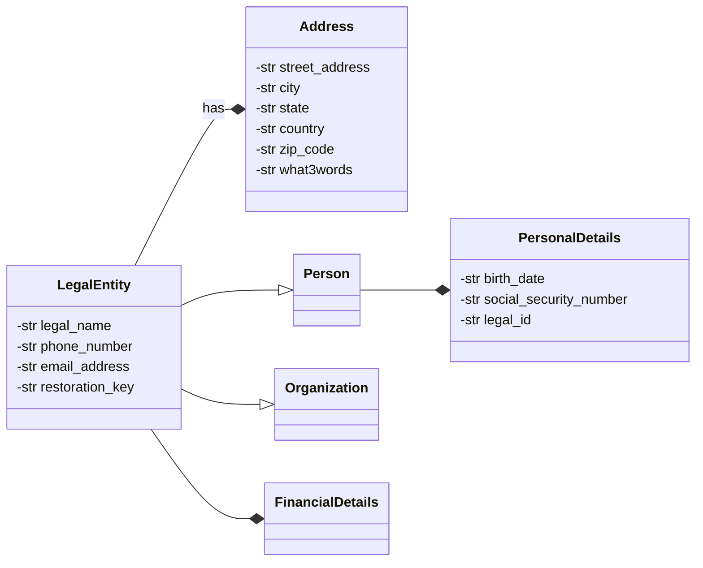

# Private Data

As outlined in **voting**, all sensitive data is stored and handled separately through LegalEntity.

## Use Cases

## Requirements

## Solutions under Consideration

# Discussion

# Conclusion