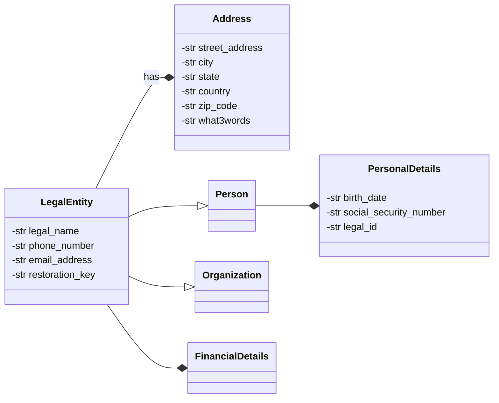

# Private Data

As outlined in **voting**, all sensitive data is stored and handled separately through LegalEntity.

## Use Cases

## Requirements

We should use [GDPR Subject Rights](https://www.gdprsummary.com/data-subject-rights) as a starting point for private data storage requirements. The Data storage system shall at minimum be secure and auditable but should be also be able to allow the system to address as much of what the  GDPR Data Subject stipulate. They are as follows:

1. The right to be informed
2. The right of access
3. The right to rectification
3. The right to erasure
4. The right to restrict processing
5. The right to data portability
6. The right to object
7. Rights about automated decision making and profiling.

## Solutions under Consideration

# Discussion

# Conclusion
