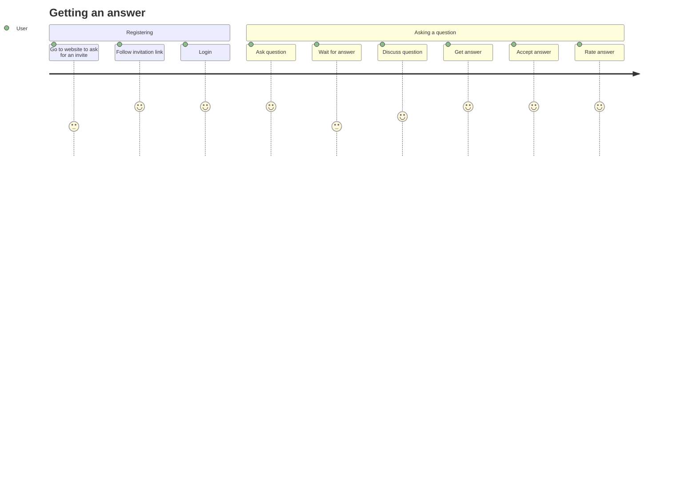

# Veiled Q|A

## What is the Veil?
The veil is a concept that is used to describe the virtual separation of the two sides of a dialog. Both sides are oblivious who the other side may be and only the messages (com-snippets) passed through to the other side are visible - imagine the [*chinese room paradox*](https://en.wikipedia.org/wiki/Chinese_room) where it is not possible to tell if there is a human or a machine inside the room by the messages passed through the door. On either side, there can be a multitude of people or machines composing in concert replies to the messages passed to them through the veil.

## How does the Veil work from the perspective of a Questioner?
A Questioner is a User who has a specific question. Initially, they have no account and want to try the system.
To create an account, they follow the process described in *authentication#Account Creation*. After that, they are logged in, using an anonymous account. They prompt the system to post the question. The system responds by creating a session and recruiting users to answer the question. The Questioner can post clarifying questions to the system, which will be passed on to the Answerers, the Users and/or Bots that are currently engaged in the session, collaborating on the replies. The Questioner can adjust parameters of the session, primarily the time limit the session will be open for answers depending on their urgency. The Questioner can also post a bounty (karma), which will be paid to the team of Answerers who provides the best answer. The Questioner can also choose to end the session, which will result in the system posting the session to the public forum.

## How does the Veil work from the perspective of an Answerer?
An Answerer is a User who loves sharing their knowledge and also loves to learn by teaching. Initially, they have no account and want to try the system. To create an account, they follow the process described in *authentication#Account Creation*. After that, they are logged in, using an anonymous account. They get the option to mark themselves available to join the pool of potential answerers. If they do so, they will be prompted to select at least one topic they are knowledgeable about or are interested in, asking them to self-assess their level of expertise in the chosen topic.

When a question is posted, the pool of available Answerers is matched against the topical closeness of the question.
The system then will recruit people (and bots) with varying degrees of expertise to answer questions in these topics (or thematically close topics). The system will then create a session and invite the Answerers to join the session. The Answerers can then collaborate on the answers to the questions posed by the Questioner(s).
