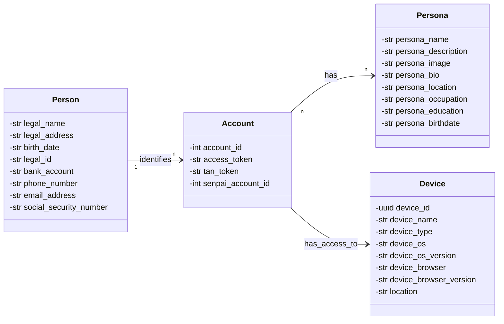
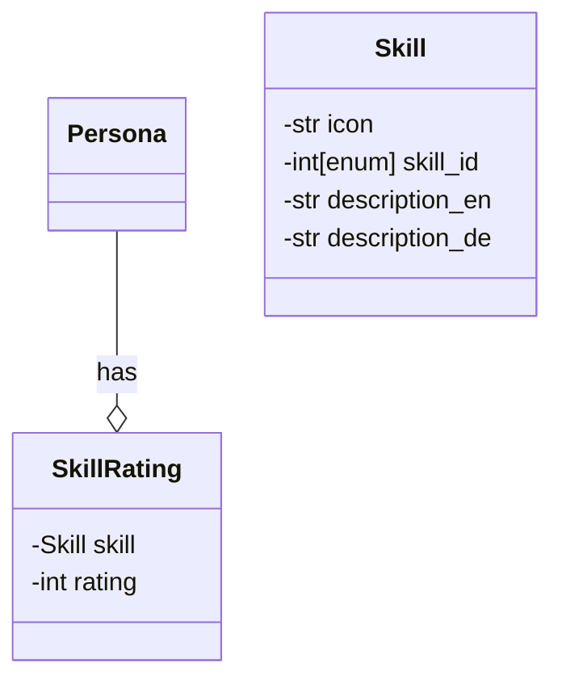

# Liquid Democracy & Condorcet Voting with transparent Skill Rating: A Path to fair, meritocratic and efficient governance

## Liquid Democracy
In the fast-paced world of technology or in intense global competition for markets and talent, it is essential to be able to make decisions quickly and efficiently to stay competitive.  This need for speed is especially true in the realm of software development where the time to market is crucial but also for any other product or service categories characterized short product life cycles, quick turnaround and obsolescence. Given the relentless time to market pressures, if the company needs to make decisions quickly or be outcompeted an authoritarian form of government like a dictatorship would be the obvious choice or top down decision making in the context of corporations or organizations but research on swarm intelligence has shown that a group of people can make better decisions than a single person (need citation) and this is especially true if the group is diverse and the members have different backgrounds and experiences. (need citation) The advantage of a democracy or bottom up decision making also extends to parties having buy-in to the decision having been created via a voting mechanism rather than having a decision imposed on them top down. Given that many teams are now globally distributed it maybe indeed difficult for many teams embracing a bottom up decsion making ethos to make timely decisions due to the time zone differences and need to consult many parties versus top down approaches. This is where Liquid Democracy comes into play can faclitate relatively faster decision making versus traditional voting processes without resorting to top down approaches.

## Users, Devices and Personas - Identity
A *Person* is a natural, legal person by definition of law. This represents the organic being behind the device in meatspace. A *User* is a digital identity, an account, that is associated with a *Person* and is used to interact with the system. A *User* can have multiple *Devices* associated with it. A device can be owned by a single specific Person, who has owned *Device* is a digital identity that is associated with a *User* and is used to interact with the system. A *Device* can be a computer, a smartphone, a tablet, a smartwatch, a smart speaker, a smart TV, a smart fridge, a smart car, a smart home, a smart city, a smart planet, a smart universe, a smart multiverse, a smart omniverse, a smart metaverse, a smart megaverse, a smart xenoverse, a smart hyperverse, a smart brane, a smart universe cluster, a smart multiverse cluster, a smart omniverse cluster, a smart metaverse cluster, a smart megaverse cluster, a smart xenoverse cluster, a smart hyperverse cluster. (Nevermind that, I got carried away.)

A Person has a uniquely identifiable identity with data required to be especially well protected (in a seperate database for example, or some blockchain).

## Skill Rating
To faciliate transparent and fair relative skill ranking among the pool of voters participating in a system that leverages liquid democratic principles, we have to make this rating public when needed in the context of voting on a particular issue or topic. These ratings will be user generated based on the interactions between the users (voters) and mechanisms (both structured and non structured) such as formal and informal debates and discussions can help populate these skill ratings. Skill ratings could as also be possibly be obtained via self administered tests but cheating in said tests have to be considered. No skill rating system is perfect and there could be bias in skill assessment if the criteria for assessing the skill is subjective but it is near impossible to make standardized skill assessment tests in nearly all pertinent issues and subject areas (also who has time and inclination to take these all these exams). If we rely on subjective relative skill evaluation by peers we gotta ensure that a large enough cohort do rate otherwise the skill ratings maybe not really accurate or subject to bias or collusion among parties to bump up each others ratings.

## Condorcet Voting
Condorcet Voting is a form of preferential voting, where you can rank the options in order of preference. The winner is the candidate that wins against all other candidates in a head-to-head comparison. This way, the winner is the candidate that is preferred by the majority of the voters. This is especially important in a democracy, where the goal is to represent the will of the people, not just the majority, but also the minority. In contrast to any other voting system, condorcet voting prevents the spoiler effect, where a candidate can win by splitting the votes of the majority. It also prevents the chicken dilemma, where a candidate can win by being the least bad option. This way, the winner is always the candidate that is preferred by the majority of the voters.

In rare instances, there can be a drawback when there is no candidate that wins against all other candidates and this is called a condorcet paradox. In this case, the winner is determined by a tiebreaker. This can be a random tiebreaker, but it can also be a tiebreaker based on the skill rating of said candidates as assessed by the voters. This way, the winner is the candidate that is preferred by the voters with the highest skill rating. This way, the winner is the candidate that is preferred by the most knowledgeable voters.
