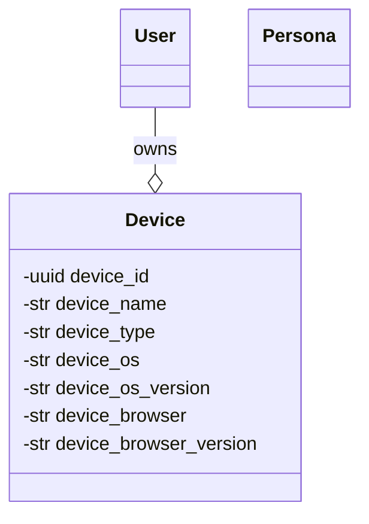
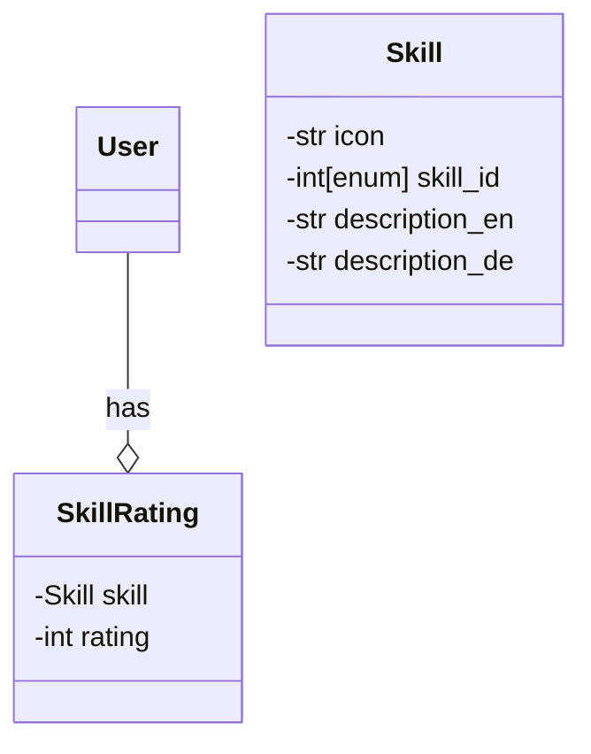

# Liquid Democracy & Condorcet Voting with transparent Skill Rating: A Path to fair, meritocratic and efficient governance
As a company in the fast-paced world of technology, it is important to be able to make decisions quickly and efficiently. This is especially true for the development of software, where the time to market is crucial.
If the prime goal is to make decisions quickly, an authoritarian government like a dictatorship would be the obvious choice. However, research on swarm intelligence has shown that a group of people can make better decisions than a single person. This is especially true if the group is diverse and the members have different backgrounds and experiences. However, if the group is distributed over the world, it is difficult to make decisions efficiently due to the time difference. This is where Liquid Democracy comes into play.

## Liquid Democracy
Liquid Democracy is a form of democracy that allows for efficient decision making while still being fair and meritocratic. It is a form of direct democracy where you can vote on issues directly, but you can also delegate your vote to another person or comittee if you don't have time to dig into an issue or don't feel confident enough about a subject. This way, the decision making process is much more efficient and fair. It also allows for a more meritocratic system, where people who are more knowledgeable about a certain topic can have more influence on the decision making process.
It is important however to be able to trust the people you delegate your vote to. This is where the transparent skill rating system comes into play. It allows you to see how much influence a person has on a certain topic and how they got there. This way, you can decide if you want to delegate your vote to them or not.

## Users, Devices and Personas

## Skill Rating
To judge

## Condorcet Voting
Condorcet Voting is a form of preferential voting, where you can rank the options in order of preference. The winner is the candidate that wins against all other candidates in a head-to-head comparison. This way, the winner is the candidate that is preferred by the majority of the voters. This is especially important in a democracy, where the goal is to represent the will of the people, not just the majority, but also the minority. In contrast to any other voting system, condorcet voting prevents the spoiler effect, where a candidate can win by splitting the votes of the majority. It also prevents the chicken dilemma, where a candidate can win by being the least bad option. This way, the winner is always the candidate that is preferred by the majority of the voters.

There is a backdraw though. In rare instances, there is no candidate that wins against all other candidates. This is called a condorcet paradox. In this case, the winner is determined by a tiebreaker. This can be a random tiebreaker, but it can also be a tiebreaker based on the skill rating of the voters. This way, the winner is the candidate that is preferred by the voters with the highest skill rating. This way, the winner is the candidate that is preferred by the most knowledgeable voters.
